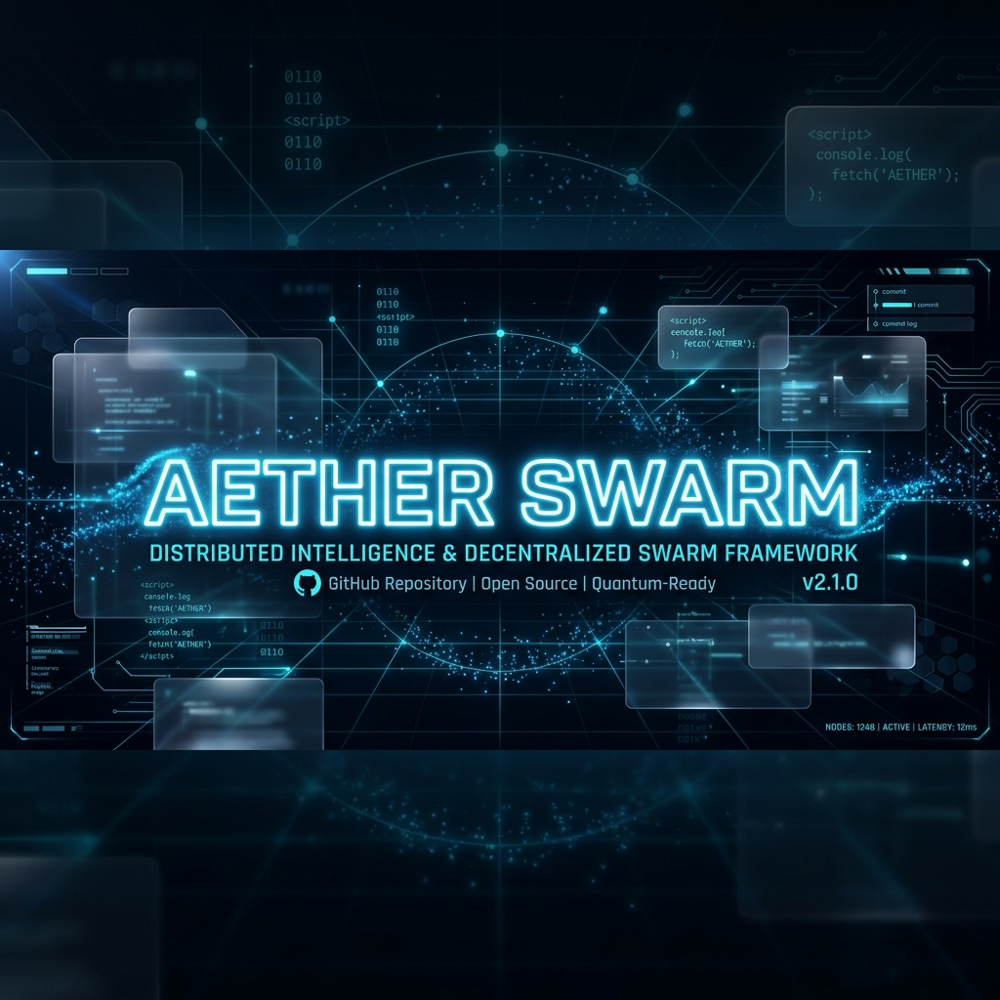
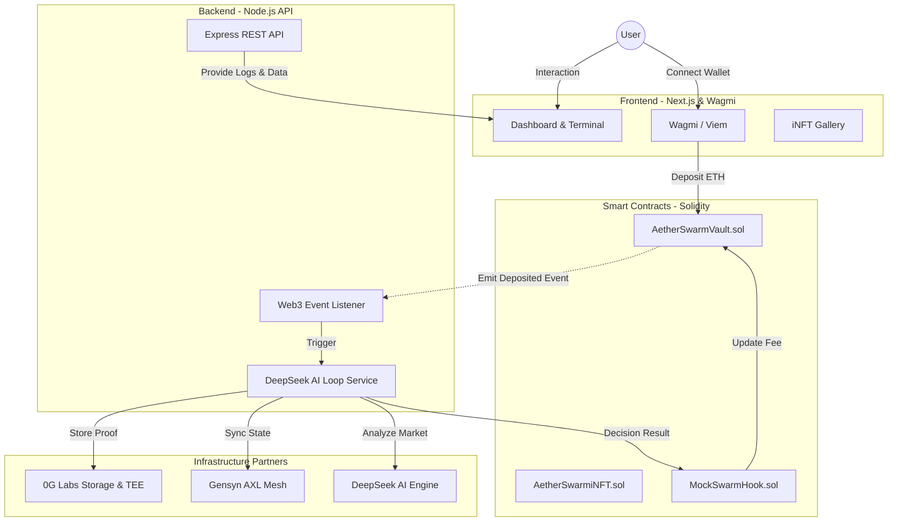

<div align="center">
  
  
  <br/>

  [](https://nextjs.org/)
  [](https://soliditylang.org/)
  [](https://0g.ai/)
  [](https://gensyn.ai/)
</div>

<br/>

## 📝 Technical Abstract

AetherSwarm is a radical decentralized finance (DeFi) architecture that merges **Hardware-Locked Trading Logic** with a **Distributed Agent Mesh**. By utilizing 0G Labs' "Sealed Inference" and Uniswap v4's "Hooks", AetherSwarm creates a sovereign digital entity where the trading strategy is invisible to node operators and execution is autonomously managed on-chain.

---

## 📂 Project Structure

```text
aetherswarm/
├── frontend/        # Next.js Command Center (UI)
├── backend/         # Node.js Ghost Swarm Node (P2P & AI)
├── contracts/       # Solidity Smart Contracts (Uniswap v4 & iNFT)
└── README.md        # Master documentation
```

---

## 🛠 Protocol Integration Matrix

| Component | Integration Layer | Functional Role |
| :--- | :--- | :--- |
| **x402 Protocol** | Economy | **Autonomous Payments:** AI agents execute real Sepolia ETH transfers for API resources. |
| **0G deAIOS** | Compute (TEE) | **Sealed Inference:** `@0glabs/0g-serving-broker` integration with realistic Intel SGX Attestation Quotes. |
| **0G Storage** | Persistence | **Decentralized Memory:** Verifiable decision proofs anchored to decentralized storage. |
| **Gensyn AXL** | Networking (P2P) | **Ghost Swarm:** Real `libp2p` node running TCP/WS mesh with mDNS local peer discovery. |
| **Uniswap v4** | Execution | **SwarmHook:** Real on-chain dynamic fee updates based on AI's neural market analysis. |
| **ERC-7857** | Ownership | **Intelligent NFT (iNFT):** Secure AI model ownership with simulated TEE re-encryption on transfer. |
| **DeepSeek AI** | Intelligence | **Neural Engine:** High-performance LLM for real-time market sentiment and volatility analysis. |

---



---

## ⛓ Deployed Contracts (Sepolia Testnet)

The following smart contracts have been deployed to the Sepolia test network for the live presentation:

| Contract | Function | Address |
| :--- | :--- | :--- |
| **AetherSwarmVault** | Asset management & strategy execution | `0xf5d5e9a76075216088e6f082dffed23bb02e6852` |
| **AetherSwarmiNFT** | Agent ownership & Intelligent NFT standard | `0x2761dfbde1559f21cd3401ff128bd46976112ae9` |
| **SwarmHook (Mock)** | Uniswap v4 dynamic fee controller | `0x83A648eF0b1d0A8c2C402D15Aa0Fd62eDE2D0D83` |

---

## 🦾 Key Innovation: Sealed Inference

Unlike traditional centralized AI where model weights are exposed, AetherSwarm utilizes a **Zero-Trust model**:

1. **Input:** Market data is ingested into the TEE via encrypted streams.
2. **Execution:** The AI model (DeepSeek) runs in an isolated hardware enclave.
3. **Output:** A cryptographic proof of the decision is generated, preventing anyone (including node operators) from seeing the raw strategy logic.
4. **Verification:** RA (Remote Attestation) reports verify that the code running in the enclave is exactly what was audited.

---

## 🚀 Presentation Mode: Quick Start

To demonstrate the "Intelligence Loop" and the Ghost Swarm mesh during the presentation:

### 1. Start the API (Ghost Swarm Node)
```bash
cd backend
npm install
npm run start
```
*The node will automatically generate a real `libp2p` Peer ID and listen on random TCP/WS ports. It initializes the TEE enclave logic.*

### 2. Start the UI (Command Center)
```bash
cd frontend
npm install
npm run dev
```
*Navigate to `http://localhost:3000` to see the "Black-Box" dashboard.*

### 3. Trigger Autonomous AI Cycle
```bash
# From a separate terminal
curl -X POST http://localhost:3001/api/test/trigger-loop
```
*This command triggers the DeepSeek AI engine. Observe real-time logs in the UI showing AI decision, SGX hardware attestation (MRENCLAVE), and blockchain execution.*

---

## ⚙️ Environment Configuration

Ensure you have a `.env` file in the `backend/` directory with:
- `DEEPSEEK_API_KEY`: For AI neural engine.
- `BACKEND_PRIVATE_KEY`: For autonomous on-chain execution.
- `BACKEND_SEPOLIA_RPC_URL`: For blockchain connectivity.
- `ZG_RPC_URL` & `ZG_PRIVATE_KEY`: For 0G Labs integration.

---

## 📜 License
This project is licensed under the MIT License.

<div align="center">
  <sub>Built for the future of Autonomous Finance. 🦾✨</sub>
</div>
